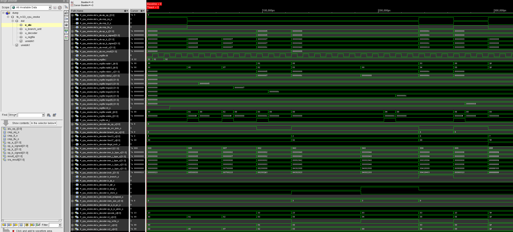
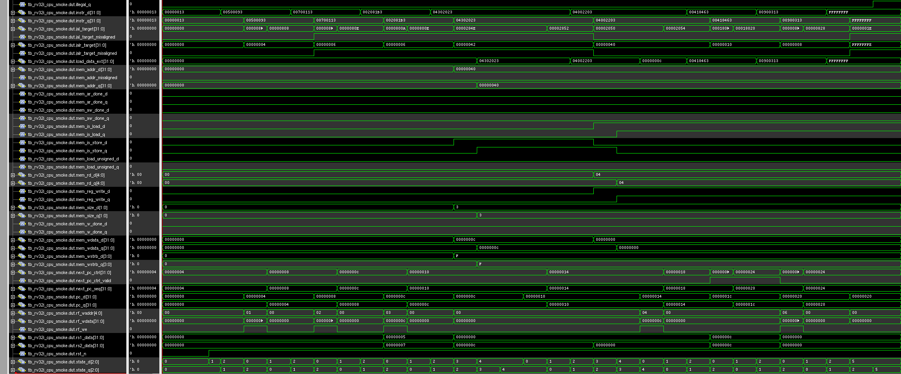

# RV32I AXI4-Lite CPU

A compact **single-clock, multi-cycle, in-order RISC-V CPU** written in **SystemVerilog**, built around a **single shared AXI4-Lite master interface** for both instruction fetch and data access.

This project is organized as a small but clean CPU design with standalone unit tests for the key blocks and a top-level smoke test that exercises the full execution path:

- arithmetic
- register writeback
- store/load through AXI4-Lite
- taken branch behavior
- skipped instruction behavior
- illegal instruction detection and halt

The latest smoke run is available in:

- `scripts/logs/tb_rv32i_cpu_smoke.log`

Waveform screenshots from the same setup are included here:

- `scripts/logs/dut_internal.png`
- `scripts/logs/dut_some_singals.png`

---

## Project highlights

- **Single-clock, multi-cycle CPU** controlled by a small FSM
- **32-bit datapath** with a **32 x 32-bit register file**
- **Shared AXI4-Lite master port** for instruction fetch and data transactions
- Separate design blocks for:
  - decoder
  - ALU
  - branch unit
  - register file
  - top-level CPU
- Unit tests for the main leaf blocks
- A readable end-to-end smoke test with execution trace, writeback trace, memory events, and final architectural checks
- Included requirements document in `doc/reqs.md`

---

## Architecture overview

This CPU is intentionally simple and educational in structure.

### Execution style

The core is:

- **single-issue**
- **in-order**
- **non-pipelined**
- **multi-cycle**
- **stallable** while waiting for AXI4-Lite responses

### Control FSM

The top-level CPU moves through the following states:

- `FETCH_REQ`
- `FETCH_WAIT`
- `EXECUTE`
- `MEM_REQ`
- `MEM_WAIT`
- `HALT`

This makes the flow easy to debug and easy to inspect in simulation.

### Memory interface

The design exposes **one AXI4-Lite master interface** and serializes:

- instruction fetches
- loads
- stores

So instruction and data traffic do **not** happen concurrently in this revision.

---

## Supported functionality

Based on the current decoder and execution path, this revision supports the main integer operations needed for a compact RV32I-style core:

### ALU / immediate / upper-immediate

- `ADD`, `SUB`
- `AND`, `OR`, `XOR`
- `SLL`, `SRL`, `SRA`
- `SLT`, `SLTU`
- `ADDI`, `ANDI`, `ORI`, `XORI`
- `SLLI`, `SRLI`, `SRAI`
- `SLTI`, `SLTIU`
- `LUI`, `AUIPC`

### Control flow

- `BEQ`, `BNE`, `BLT`, `BGE`, `BLTU`, `BGEU`
- `JAL`, `JALR`

### Loads / stores

- `LB`, `LH`, `LW`
- `LBU`, `LHU`
- `SB`, `SH`, `SW`

### Exception behavior in this revision

Unsupported or invalid instructions are treated as **illegal instructions**.

In particular, this revision marks the following as illegal:

- `FENCE` / `MISC_MEM`
- `SYSTEM` instructions
- invalid opcode/funct combinations
- misaligned control-flow targets
- misaligned memory accesses
- AXI error responses

---

## What is intentionally not included

This project focuses on a clean baseline CPU implementation, not a high-performance core.

Out of scope in this revision:

- pipelining
- branch prediction
- caches
- interrupts / privilege modes / CSR subsystem
- multiple outstanding transactions
- AXI burst behavior
- multiply/divide extensions
- compressed instructions

---

## Repository structure

```text
RISCV_mine-main/
├── doc/
│   └── reqs.md
├── scripts/
│   ├── clean.sh
│   ├── run.sh
│   └── logs/
│       ├── dut_internal.png
│       ├── dut_some_singals.png
│       └── tb_rv32i_cpu_smoke.log
├── src/
│   ├── rv32i_pkg.sv
│   ├── rv32i_regfile.sv
│   ├── rv32i_decoder.sv
│   ├── rv32i_alu.sv
│   ├── rv32i_branch_unit.sv
│   ├── rv32i_cpu.sv
│   └── unit_tests/
│       ├── tb_rv32i_alu_sanity.sv
│       ├── tb_rv32i_branch_unit_sanity.sv
│       ├── tb_rv32i_cpu_smoke.sv
│       ├── tb_rv32i_decoder_sanity.sv
│       └── tb_rv32i_regfile_sanity.sv
└── README.md
```

---

## Verification strategy

The project uses two levels of verification:

### 1) Block-level sanity tests

There are standalone tests for:

- **ALU** → `tb_rv32i_alu_sanity.sv`
- **branch unit** → `tb_rv32i_branch_unit_sanity.sv`
- **decoder** → `tb_rv32i_decoder_sanity.sv`
- **register file** → `tb_rv32i_regfile_sanity.sv`

These isolate the main combinational and architectural building blocks before integrating the full CPU.

### 2) End-to-end CPU smoke test

The main demonstration test is:

- `src/unit_tests/tb_rv32i_cpu_smoke.sv`

It runs a small hand-authored program that verifies the full execution path:

1. write `5` into `x1`
2. write `7` into `x2`
3. compute `x3 = x1 + x2 = 12`
4. store `x3` into memory
5. load it back into `x4`
6. take a `BEQ` because `x3 == x4`
7. intentionally skip the next instruction
8. execute the branch target and write `x6 = 9`
9. fetch an illegal instruction and halt

The smoke test log is intentionally verbose and shows:

- fetch activity
- AXI read/write events
- register writeback events
- branch control decisions
- milestone messages
- final architectural state

See:

- `scripts/logs/tb_rv32i_cpu_smoke.log`

---

## Example smoke-test result

The checked final state from the included log is:

```text
x1 = 0x00000005
x2 = 0x00000007
x3 = 0x0000000c
x4 = 0x0000000c
x5 = 0x00000000
x6 = 0x00000009
mem[16] = 0x0000000c
illegal_instr = 1
CPU smoke finished | PASS=9 FAIL=0
```

That result shows that the CPU successfully completed arithmetic, memory access, control flow, and illegal-instruction handling in one integrated run.

---

## Running the project

### Prerequisite

The provided script is set up for **Cadence Xcelium / xrun**.

### Run the CPU smoke test

```bash
cd scripts
bash run.sh
```

This script compiles:

- `rv32i_pkg.sv`
- `rv32i_regfile.sv`
- `rv32i_decoder.sv`
- `rv32i_alu.sv`
- `rv32i_branch_unit.sv`
- `rv32i_cpu.sv`
- `tb_rv32i_cpu_smoke.sv`

and writes the simulator log to:

- `scripts/logs/tb_rv32i_cpu_smoke.log`

### Clean generated simulation files

```bash
cd scripts
bash clean.sh
```

---

## Waveform / debug artifacts

Two waveform screenshots are already included under `scripts/logs/`.

### Internal DUT view



### Selected DUT signals view



These are useful if you want a quick visual check of:

- state transitions
- PC flow
- instruction movement
- memory request/response behavior
- writeback timing
- illegal-instruction halt behavior

For the full textual run trace, refer to:

- `scripts/logs/tb_rv32i_cpu_smoke.log`

---

## Design notes

A few implementation choices are worth highlighting:

- The register file implements **x0 as hardwired zero**.
- The CPU shares one AXI4-Lite master interface between instruction and data accesses.
- Handshake handling in the CPU is written to avoid false state advances before a real `valid && ready` transfer occurs.
- Branch behavior is checked both functionally and architecturally in the smoke test.
- Illegal instruction handling is visible both in the live trace and in the final pass/fail checks.

---

## Requirements document

A more formal hardware requirements document is included here:

- `doc/reqs.md`

That file describes:

- system-level requirements
- port behavior
- register file requirements
- fetch/decode/ALU/branch behavior
- memory access requirements
- illegal instruction handling

---

## Why this project is useful

This repository is a good fit for:

- learning CPU microarchitecture fundamentals
- practicing SystemVerilog RTL organization
- understanding multi-cycle control
- seeing how a simple CPU can be connected to an AXI4-Lite style memory model
- building a clean portfolio project with both design and verification artifacts

---

## Author

**Alican Yengec**

If you want, you can extend this core next with:

- a richer instruction-memory/data-memory environment
- more directed CPU programs
- pipeline stages
- CSR / interrupt support
- a proper bus-functional memory model
  

---
## My Future work: Will develop a UVM TB constrained-random verification by using my own AXI4-Lite VIP which is on my github.
---
## Hardware Design Requirements

For the complete project requirements, see [doc/reqs.md](doc/reqs.md).
