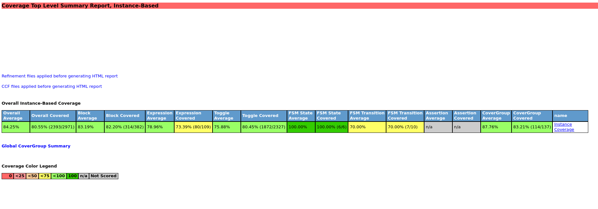
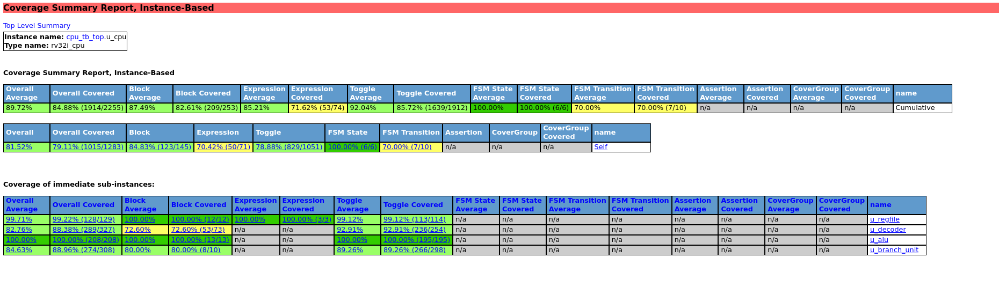
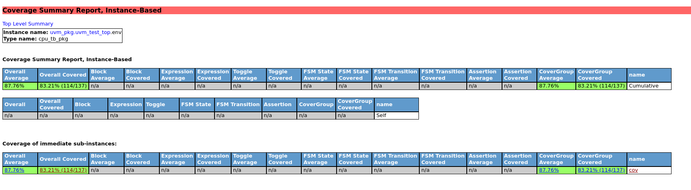

# rv32i_axi4l_subsystem_uvm_tb

[](https://accellera.org/)
[](https://riscv.org/)
[](#)

This repository contains a self-checking UVM verification environment for an RV32I AXI4-Lite CPU subsystem. The testbench builds small RISC-V programs, preloads them into the AXI4-Lite RAM model, runs the same program in a SystemVerilog reference model, releases the RTL CPU, and compares the final architectural state.

The current flow is designed to make debug readable. Every important phase can be seen in the log:

- `PRELOAD STEP`: instruction was generated by the test sequence and written into instruction memory.
- `REF STEP`: the golden reference model executed the same instruction and calculated the expected result.
- `DUT_TRACE`: the RTL fetched, executed, loaded, stored, wrote back, or halted.
- Scoreboard result: final register and memory comparison.

## Design And Requirements Process

This project starts from a written hardware requirements document, not directly from tests. The full requirement set is in `doc/reqs.md`.

The requirement document defines this revision as a compact RV32I core with the following scope:

- single-issue, in-order, non-pipelined execution
- one synchronous clock domain
- active-low reset
- 32-bit datapath and 32-bit address space
- one shared AXI4-Lite master interface for instruction fetch and data memory
- at most one outstanding AXI4-Lite transaction
- serialized fetch/load/store traffic
- illegal-instruction halt behavior for unsupported instructions, bus errors, and misaligned accesses

Out of scope for this revision:

- pipelining
- branch prediction
- caches
- interrupts, privilege modes, and CSRs
- multiple outstanding transactions
- AXI burst behavior
- multiply/divide, compressed, or other ISA extensions

### Requirement Groups

`doc/reqs.md` currently tracks 85 requirements:

| Group | Count | Examples |
|---|---:|---|
| System | 11 | reset vector, execution model, AXI serialization |
| Register file | 8 | x0 behavior, reset values, read/write ports |
| Instruction fetch | 10 | PC update, fetch alignment, AXI read behavior |
| Decode | 12 | opcode, `funct3`, `funct7`, immediate extraction |
| ALU | 15 | arithmetic, logical, shift, compare, upper immediate |
| Branch/jump | 10 | branch conditions, JAL, JALR, target alignment |
| Memory | 24 | load/store width, strobes, AXI handshakes, alignment |
| Exception | 5 | illegal instruction, bus error, misaligned access halt |

### Design Decomposition

The RTL is split along the same boundaries as the requirement groups:

| RTL block | Requirement focus |
|---|---|
| `rv32i_pkg` | shared opcodes, ALU controls, memory sizes, reset vector |
| `rv32i_regfile` | RF requirements and x0 semantics |
| `rv32i_decoder` | instruction formats, immediates, opcode/funct legality |
| `rv32i_alu` | arithmetic, logical, shift, compare, LUI/AUIPC behavior |
| `rv32i_branch_unit` | branch decision and jump target calculation |
| `rv32i_cpu` | multi-cycle FSM, AXI4-Lite control, stalls, halt behavior |

### CPU Architecture Overview

The CPU is intentionally simple and inspectable. It is a compact single-clock, multi-cycle, in-order RV32I core with one shared AXI4-Lite master interface.

The top-level execution FSM uses these conceptual phases:

| State | Purpose |
|---|---|
| `FETCH_REQ` | issue an AXI4-Lite read for the instruction at the current PC |
| `FETCH_WAIT` | wait for the instruction read response |
| `EXECUTE` | decode and execute ALU, branch, jump, or address-generation work |
| `MEM_REQ` | issue a load or store transaction when the instruction needs data memory |
| `MEM_WAIT` | wait for load data or store response |
| `HALT` | stop execution after illegal instruction, bus error, or misaligned access |

Because instruction fetch, load, and store all share one AXI4-Lite master interface, the design serializes traffic. A data transaction cannot overlap with an instruction fetch in this revision. That behavior is deliberate and maps directly to the single-outstanding-transaction requirements.

### Supported Functionality

This revision implements the main RV32I base integer operations needed by the directed and random tests:

| Area | Instructions / behavior |
|---|---|
| ALU arithmetic | `ADD`, `SUB`, `ADDI` |
| ALU logical | `AND`, `OR`, `XOR`, `ANDI`, `ORI`, `XORI` |
| Shifts | `SLL`, `SRL`, `SRA`, `SLLI`, `SRLI`, `SRAI` |
| Comparisons | `SLT`, `SLTU`, `SLTI`, `SLTIU` |
| Upper immediate | `LUI`, `AUIPC` |
| Branches | `BEQ`, `BNE`, `BLT`, `BGE`, `BLTU`, `BGEU` |
| Jumps | `JAL`, `JALR` |
| Loads | `LB`, `LH`, `LW`, `LBU`, `LHU` |
| Stores | `SB`, `SH`, `SW` |
| Exception behavior | unsupported instructions, invalid decode combinations, bus errors, and misaligned accesses halt the CPU |

### Verification Traceability

The UVM tests are organized to exercise requirement groups directly:

| Requirement area | Main tests/sequences |
|---|---|
| ALU and writeback | `cpu_basic_alu_test`, `cpu_basic_alu_seq` |
| Load/store data path and byte lanes | `cpu_load_store_test`, `cpu_load_store_seq` |
| Branch and jump control flow | `cpu_branch_test`, `cpu_branch_seq` |
| Illegal instruction halt | `cpu_illegal_instr_test` |
| General randomized datapath stress | `cpu_random_test`, `cpu_random_prog_seq` |
| Architectural final-state checking | reference model plus scoreboard |
| Coverage closure | `cpu_coverage.sv` and merged coverage report |

The important idea is that the sequence log, reference-model log, DUT trace, scoreboard, and coverage report are all tied back to the same requirement categories. That makes the debug flow explainable: if a coverage hole remains in a branch, memory, or ALU category, the next step is a targeted sequence rather than random guessing.

## Verification Flow

```text
Test sequence
  |
  | build ordered RV32I instruction stream
  v
Instruction preload
  |
  | write program into RAM through testbench backdoor
  v
Reference model
  |
  | execute the same program in zero time
  v
RTL execution
  |
  | release reset, fetch from AXI4-Lite RAM, execute until halt
  v
Scoreboard
  |
  | compare DUT registers and data memory against reference model
  v
PASS / FAIL
```

## Directory Structure

```text
rv32i_axi4l_subsystem_uvm_tb/
|-- doc/              Hardware requirements document
|-- rtl/              CPU RTL
|-- mem_model/        AXI4-Lite RAM simulation model
|-- env/              UVM environment, reference model, scoreboard, coverage
|-- sequences/        RV32I program-building sequences
|-- tests/            UVM test classes
|-- tb/               Top-level testbench and DUT trace monitor
|-- scripts/          Xcelium run, regression, and coverage scripts
`-- my_run_logs/      Saved screenshots and sanitized debug examples
```

## Sequence Naming

The program builders under `sequences/` are normal UVM sequences, not virtual sequences. They create ordered instruction streams and metadata, but they do not coordinate multiple lower-level sequencers. For that reason their names use the `*_seq` form:

| Sequence | Purpose |
|---|---|
| `cpu_basic_alu_seq` | Directed ALU and immediate operation program |
| `cpu_load_store_seq` | Directed byte, halfword, and word memory access program |
| `cpu_branch_seq` | Directed branch, jump, and JALR control-flow program |
| `cpu_random_prog_seq` | Constrained-random valid RV32I program generation |

## Memory Map

| Region | Address Range | Usage |
|---|---:|---|
| Instruction memory | `0x000` to `0x1ff` | Program preloaded by the testbench |
| Data memory | `0x200` to `0x3ff` | Load/store checkpoint area checked by the scoreboard |

## Test Suite

| Test | Main intent |
|---|---|
| `cpu_basic_alu_test` | R-type and I-type ALU operations, register writeback, x0 behavior |
| `cpu_load_store_test` | `LB/LH/LW/LBU/LHU` and `SB/SH/SW`, including byte lanes and unaligned byte/halfword accesses |
| `cpu_branch_test` | `BEQ/BNE/BLT/BGE/BLTU/BGEU`, `JAL`, and `JALR` control flow |
| `cpu_illegal_instr_test` | Unsupported instruction halt behavior |
| `cpu_random_test` | Randomized valid programs to stress datapath and scoreboard consistency |

## How To Run

Run commands from the `scripts/` directory.

### Single Test

This compiles and runs one test in a standalone output directory.

```bash
cd scripts
./run_xrun.sh cpu_basic_alu_test
```

Run a random test with a fixed seed:

```bash
./run_xrun.sh cpu_random_test 12345
```

The log is written under:

```text
output/<test_name>_<seed>/xrun.log
```

### Compile Once, Run From Snapshot

Use this when running several tests during debug. Compile/elaborate once:

```bash
cd scripts
./compile_xrun.sh
```

Then run individual tests from the compiled snapshot:

```bash
./run_xrun_snapshot.sh cpu_basic_alu_test
./run_xrun_snapshot.sh cpu_load_store_test
./run_xrun_snapshot.sh cpu_random_test 12345
```

### Full Regression

The regression script compiles once, then runs the directed and random tests from the snapshot:

```bash
cd scripts
./run_xrun_regression.sh
```

Expected final shape:

```text
Regression Summary
  PASS  cpu_basic_alu_test
  PASS  cpu_load_store_test
  PASS  cpu_branch_test
  PASS  cpu_illegal_instr_test
  PASS  cpu_random_test

PASS: 5 / 5
FAIL: 0 / 5
```

## Reading The Logs

The log is intentionally step-by-step. First, the sequence writes the program into instruction memory:

```text
PRELOAD STEP 005 ADDR=0x00000014 INSTR=0x003102b3  ADD: x5 = x2 + x3 = 10 + 3 -> 13
PRELOAD STEP 006 ADDR=0x00000018 INSTR=0x0050a023  CHECKPOINT: SW x5 -> MEM[0x200], expect 0x0000000d
```

Then the reference model runs the same program and records the expected architectural updates:

```text
REF STEP 005 PC=0x00000014 INSTR=0x003102b3  ADD  x5 <= x2(0x0000000a) + x3(0x00000003) = 0x0000000d
REF STEP 006 PC=0x00000018 INSTR=0x0050a023  STORE MEM[0x00000200] <= x5(0x0000000d)
```

During RTL execution, the DUT trace shows fetch, writeback, load/store, and halt activity live:

```text
DUT FETCH_REQ  PC=0x00000014
DUT FETCH_RSP  PC=0x00000014 INSTR=0x003102b3
DUT WRITEBACK x5 <= 0x0000000d
DUT FETCH_REQ  PC=0x00000018
DUT FETCH_RSP  PC=0x00000018 INSTR=0x0050a023
DUT STORE_REQ  ADDR=0x00000200 DATA=0x0000000d STRB=0xf
DUT STORE_RSP  BRESP=0x0
```

Load/store tests make byte lane behavior visible:

```text
DUT STORE_REQ  ADDR=0x00000222 DATA=0x00630000 STRB=0xc
DUT STORE_RSP  BRESP=0x0
DUT LOAD_REQ   ADDR=0x00000220
DUT LOAD_RSP   ADDR=0x00000220 DATA=0x00630000
DUT STORE_REQ  ADDR=0x00000224 DATA=0x00630000 STRB=0xf
All 32 registers MATCH
Data memory match (32 words)
=== TEST PASSED ===
UVM_ERROR :    0
UVM_FATAL :    0
```

Branch and JALR tests show the control-flow target explicitly:

```text
PRELOAD STEP 030 ADDR=0x00000078 INSTR=0x008b0ae7  JALR: x21 = PC+4, next_pc = x22 + 8 = 0x80, skip next poison write
REF STEP 025 PC=0x00000078 INSTR=0x008b0ae7  JALR x21 <= 0x0000007c, next_pc=0x00000080
DUT FETCH_REQ  PC=0x00000078
DUT FETCH_RSP  PC=0x00000078 INSTR=0x008b0ae7
DUT WRITEBACK x21 <= 0x0000007c
DUT FETCH_REQ  PC=0x00000080
DUT FETCH_RSP  PC=0x00000080 INSTR=0x00100813
DUT WRITEBACK x16 <= 0x00000001
DUT HALT       illegal_instr=1
All 32 registers MATCH
Data memory match (32 words)
=== TEST PASSED ===
```

For illegal-instruction tests, the expected result is a controlled halt:

```text
PASS: CPU halted on illegal instruction
```

For a longer per-test trace reference, see `my_run_logs/regression_trace_examples.md`. That page collects the relevant sanitized debug lines from the regression logs without copying user names, host names, absolute paths, or tool installation paths.

## Coverage Merge And HTML Report

Each run writes coverage below its own `output/<test_name>_<seed>/cov_work` directory. After running regression, merge the run databases and generate HTML in your own IMC/Xcelium environment.

The coverage merge helper script is intentionally not part of the released project documentation flow. Different teams usually have different IMC versions, filesystem layouts, and report publishing rules, so users should create their own merge command or local Tcl file for their environment.

The expected manual flow is:

1. Find all per-test coverage runs under `output/*/cov_work/scope/test*`.
2. Merge those runs with IMC.
3. Build a merged database under `cov_work/scope/merged_coverage_report_rc`.
4. Generate the HTML report under `merged_coverage_report_rc_html/`.

Open the report entry point:

```text
scripts/merged_coverage_report_rc_html/index.html
```

Note: generated IMC HTML can include machine-specific metadata in the header. Do not copy that metadata into committed documentation or shared logs.

## Current Coverage Snapshot

The current merged report shows good directed-test progress and clear closure targets.

| Metric | Current result |
|---|---:|
| Top-level average | `84.25%` |
| Overall covered | `80.55%` (`2393 / 2971`) |
| Block average | `83.19%` |
| Block covered | `82.20%` (`314 / 382`) |
| Expression average | `78.96%` |
| Expression covered | `73.39%` (`80 / 109`) |
| Toggle average | `75.88%` |
| Toggle covered | `80.45%` (`1872 / 2327`) |
| FSM state coverage | `100.00%` (`6 / 6`) |
| FSM transition coverage | `70.00%` (`7 / 10`) |
| Functional covergroup average | `87.76%` |
| Functional covergroup covered | `83.21%` (`114 / 137`) |
| Functional uncovered bins | `23` |







### Coverage Interpretation

The coverage results show that the core instruction flow, register comparison, memory checking, and several directed corner cases are already active in regression. FSM state coverage is complete, which means all modeled CPU states are reached. The remaining closure work is mostly in FSM transitions, expression coverage, toggle coverage, and uncovered functional bins.

Functional coverage is currently `83.21%` covered with `23` uncovered bins. Those holes should drive the next set of targeted tests instead of adding random tests blindly.

## Next Version Goals

The next version should turn this from a working verification environment into a coverage-closure flow:

- Push code coverage close to `100%`.
- Reach `100%` functional coverage.
- Add targeted tests for uncovered opcode, `funct3`, register, branch, and memory-access bins.
- Add directed cases for the missing FSM transitions.
- Improve random program generation so it intentionally targets coverage holes.
- Treat merged coverage and regression pass/fail as release criteria.

## Pass Criteria

A clean run means:

- The selected test prints `=== TEST PASSED ===`.
- `UVM_ERROR` is `0`.
- `UVM_FATAL` is `0`.
- The scoreboard reports all 32 registers matching.
- The scoreboard reports the checked data-memory window matching.
- Coverage merge completes when coverage is part of the run objective.
